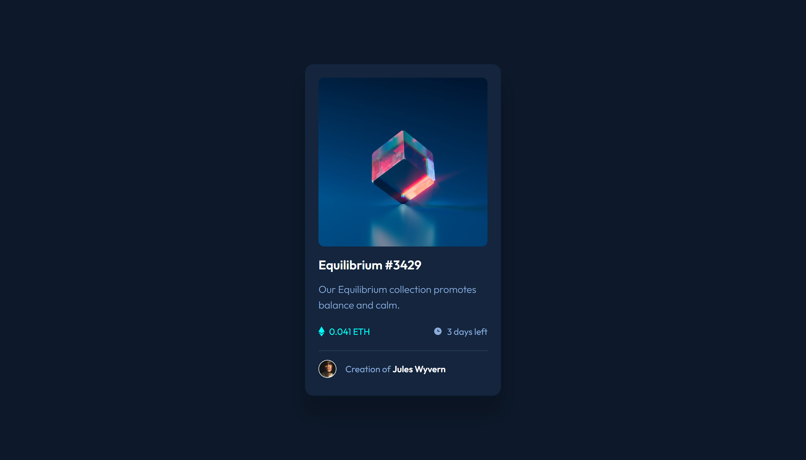

# Frontend Mentor - NFT preview card component solution

This is a solution to the [NFT preview card component challenge on Frontend Mentor](https://www.frontendmentor.io/challenges/nft-preview-card-component-SbdUL_w0U).

## Table of contents

- [Overview](#overview)
  - [The challenge](#the-challenge)
  - [Screenshot](#screenshot)
  - [Links](#links)
- [My process](#my-process)
  - [Built with](#built-with)
  - [What I learned](#what-i-learned)
- [Author](#author)

## Overview

### The challenge

Users should be able to:

- View the optimal layout depending on their device's screen size  
- See hover states for interactive elements  

### Screenshot

### Links

- Solution URL: [Frontend Mentor](https://www.frontendmentor.io/challenges/nft-preview-card-component-SbdUL_w0U)  
- Live Site URL: [GitHub Pages](https://1krasyuk.github.io/nft-preview-card-component/)  

## My process

### Built with

- Semantic HTML5 markup  
- CSS custom properties  
- Mobile-first workflow  

### What I learned

The main focus of this project was applying a **mobile-first approach** and achieving a **pixel-perfect match** with the design.  
I challenged myself to complete it in **under 2 hours**, which made it a great exercise in working quickly while still maintaining clean, semantic code.
Key things I focused on: 

- Writing layouts in a **mobile-first** approach for better responsiveness.  
- Keeping the codebase **clean and minimal**, avoiding unnecessary complexity.  
- Using **semantic HTML** to ensure proper structure and accessibility.  
- Achieving **pixel-perfect** alignment with the design.  
  
## Author

- Frontend Mentor - [@1krasyuk](https://www.frontendmentor.io/profile/1krasyuk)  
- Twitter (X) - [@1krasyuk](https://x.com/1krasyuk)  
